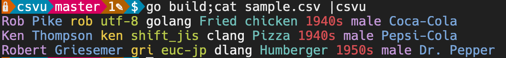
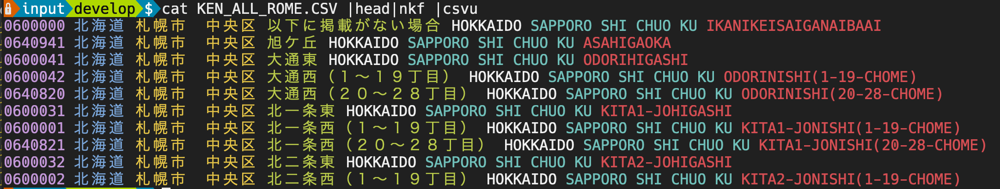

## Introduction

`csvu` is a very simple CSV colorizer, written in Golang.

Inspired by a [rainbow_csv](https://github.com/mechatroner/rainbow_csv) plugin for vim.
Just read "cs-view".

## Installation

If you have the environment for Golang development, just do the following:

```bash
go get github.com/hachi8833/csvu
```

## Usage

`csvu` has the traditional stdin/stdout.

```bash
cat sample.csv|csvu
```



Note that `csvu` has no other features such as specifying encodes. If you need to change encoding of the CSV, just use another command such as `nkf`.

```bash
cat sample.csv|nkf|csvu
```


